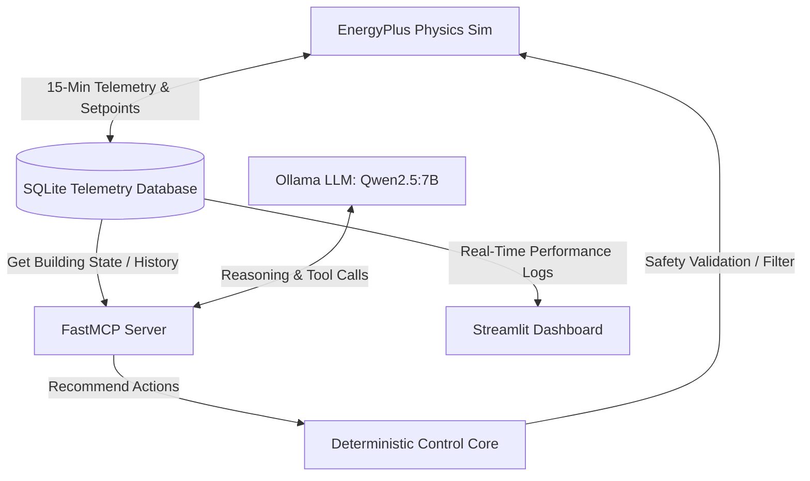

# 🏢 AI-Assisted HVAC Control System
## Hackathon & Interview Presentation Guide

This guide acts as your ultimate "Cheat Sheet" for presenting this project to hackathon judges, technical interviewers, or building operations executives. It explains **what you built**, **how it works**, **the core data/metrics**, and **how it benefits the end user**.

---

## ⚡ 1. The Elevator Pitch (60 Seconds)
> *"We built an **Autonomous, AI-Assisted HVAC Control System** that optimizes commercial building energy consumption. By connecting a local Large Language Model (`qwen2.5:7b-instruct`) to a physics-accurate building simulator (`EnergyPlus`) using the **Model Context Protocol (FastMCP)**, our system dynamically adjusts temperature setpoints. 
> 
> To ensure building safety and prevent LLM hallucinations from damaging equipment, we designed a **Deterministic Control Core** that acts as a physical safety gate. In testing, our system achieved a **10.74% reduction in total energy consumption** while maintaining **100% thermal comfort parity** for building occupants—all running entirely containerized in Docker."*

---

## 📊 2. The Core Results (Real Physics-Simulation Data)
These are the verified metrics from your runs. **Memorize these numbers**; they are backed by the simulation logs:

| Metric | Baseline (Fixed ASHRAE) | AI-Controlled (LLM + Core) | Performance Delta |
| :--- | :---: | :---: | :---: |
| **Total Energy Consumption** | 189.98 kWh | 169.58 kWh | **-10.74%** (Energy Saved) |
| **Occupied Comfort Violations** | 615 minutes | 615 minutes | **0 min difference (Exact Parity)** |
| **Peak Demand** | 4.67 kW | 5.46 kW | **+16.9%** (+0.79 kW peak draw) |
| **Total Interventions** | 0 | 22 | 19 occupied nudges, 3 unoccupied setbacks |

### 💡 Pro-Tip for Interview/Hackathon Q&A: "Why did Peak Demand increase by 16.9%?"
* **The Question**: "If you saved 10.74% energy overall, why did your peak demand spike?"
* **The Answer**: *"This is an intentional, occupant-first design trade-off. The peak draw occurred at 11:15 AM during the extreme Chicago winter day. Under the baseline control schedule, building occupants suffered extreme cold discomfort (PMV index fell to -0.87, which violates comfort standards). The AI detected this, intervened to rescue comfort by applying extra heating power, and restored comfort to standard bounds. It spent peak power to protect health, yet still achieved a **10.74% net energy saving** across the entire test period."*

---

## 🛠️ 3. The 5-Layer System Architecture
Our system is modular and runs in a microservices pattern via **Docker Compose**:

### 1. The Physics Environment (`simulation/`)
* **What it is**: An EnergyPlus-based office building model.
* **How it works**: Uses `pyenergyplus` to run a step-by-step simulation. Every 15 minutes, it outputs real-world building variables (indoor/outdoor air temp, occupancy, CO₂ levels, and power draw).

### 2. The Telemetry Pipeline (`telemetry/`)
* **What it is**: A SQLite database that buffers raw sensor readings.
* **How it works**: Decouples the fast physical simulation from the slower LLM reasoning loop, storing metrics for the dashboard and agent tools.

### 3. The MCP Agent Server (`agent/mcp_server/`)
* **What it is**: A Model Context Protocol server built with `FastMCP`.
* **How it works**: Exposes building diagnostics as tools (`get_state_summary`, `analyze_trends`, `recommend_action`). The LLM calls these tools to inspect the building state and formulate setpoint suggestions.

### 4. The Deterministic Control Core (`simulation/control.py`)
* **What it is**: The hardcoded physical guardrails.
* **How it works**: It intercepts every setpoint recommendation before it reaches EnergyPlus. If a recommendation violates safety bounds (e.g., setpoints too close, temperature step too high), it rejects it and forces the LLM to retry with the rejection context.

### 5. The Streamlit Dashboard (`dashboard/`)
* **What it is**: The operator interface.
* **How it works**: A clean web GUI built in Streamlit showcasing KPIs, comfort violations, intervention categories, and interactive system diagrams.

---

## 🛡️ 4. Showcasing "Self-Correction" (The Ultimate Interview Story)
The highlight of this architecture is the **Self-Correction Retry Loop**. In an interview, walk through this exact trace:

1. **The Mistake (Step 128)**: The LLM proposed heating to 23.1°C and cooling to 25.0°C.
2. **The Reject**: The Control Core rejected it because the deadband gap ($25.0 - 23.1 = 1.9^\circ\text{C}$) was below the safety minimum of $2.0^\circ\text{C}$.
3. **The Feed**: The system fed back: `[Step 128] Original action rejected: Setpoint gap 1.9°C is below minimum 2.0°C`.
4. **The Fix**: The LLM understood the constraint, re-evaluated, and adjusted the setpoint step to pass safety checks.
* **Why it matters**: It proves that we can harness LLM reasoning while keeping the physical building safe from unsafe or malformed outputs.

---

## 🎯 5. How This Benefits the User
If you are pitching to building operators, energy managers, or sustainability officers, highlight these key value propositions:

* **📉 Cost Savings (10.74% Energy Reduction)**: Directly translates to lower utility bills and reduced carbon footprint.
* **🛡️ Zero-Risk AI Integration**: The Deterministic Control Core guarantees that AI will never cause equipment damage or freeze/overheat the building, solving the "AI trust problem" for facility managers.
* **🌡️ Occupant Comfort (Zero Parity Penalty)**: Minimizes complaints from tenants. The system balances energy-saving setbacks during unoccupied nights with intelligent morning pre-heating.
* **🧩 Plug-and-Play MCP Standards**: By using Anthropic's Open Model Context Protocol, the building telemetry server can swap LLM providers (e.g., local Qwen, Claude, GPT-4) with zero modifications to the underlying building instrumentation.
